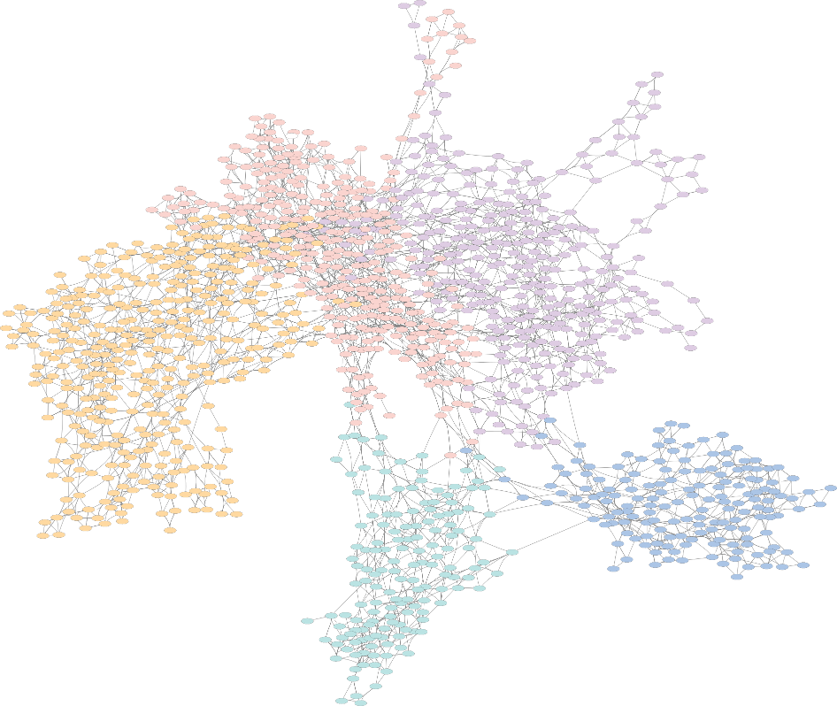

# Residue Interaction Network of the Coagulation Factor VIII Protein Structure (FVIII-RIN)

### Thanks for your interest in using the FVIII Residue Interaction Network (RIN).



Hemophilia A is a relatively rare hereditary coagulation disorder, caused by the synthesis of defective Factor VIII protein. This condition impairs the coagulation cascade, and if left untreated, causes permanent joint damage and poses a risk of fatal intracranial hemorrhage in case of traumatic events. In its severe form, patients who have access to supportive health care systems can benefit from prophylactic treatment, which consists of regular life-long administrations of recombinant forms of the FVIII protein.

We transformed the FVIII protein structure in an undirected, unweighted graph, where the nodes are the amino acids, and two nodes are connected by an edge if the amino acids are close to each other in the 3D structure.

With this simple and intuitive approach, we calculated several centrality measures of the residues of the network and observed that perturbations to the most central residues produce the same effects as alanine mutations – namely, the reduction in expression and chromogenic activity.

Here you will find the datasets and the source code used in the manuscript “Protein residue network analysis reveals fundamental properties of the human coagulation factor VIII”, by Tiago Lopes, Ricardo Rios, Tatiane Nogueira and Rodrigo Mello (Submitted).

Please note that we cannot make available the data from other databases; to access the complete mutation datasets, please visit the EAHAD and the CHAMPS websites.

The organization of the material is:

> - **/datasets** - contains the datasets to reproduce our findings and create the figures. 
> - **/src** - contains the source code for the machine learning framework and for other analyses.
> - **/results** - you can find the pre-trained classification models in this folder.
> - **/workdir** - please execute the code when you are inside this directory.

To reproduce all experiments using individual ML classification models on the training dataset, please run the source codes:

```Prolog
Rscript ../src/plot_centrality.R
```

You can also open R and run everything (inside the workdir directory), for example:

```Prolog
source(“../src/plot_centrality.R”)
```

To run our machine learning models, from the workdir directory, run the following command:

```Prolog
source(“run-all.R”)
```
All machine learning models are saved in the results/models directory and the final result table is stored in results/final-table.csv.

If you find any issues with the code, please contact us: tiago-jose@ncchd.go.jp, ricardoar@ufba.br

On the behalf of all of the authors, we appreciate your interest in the FVIII RIN and hope it is useful to your research.
